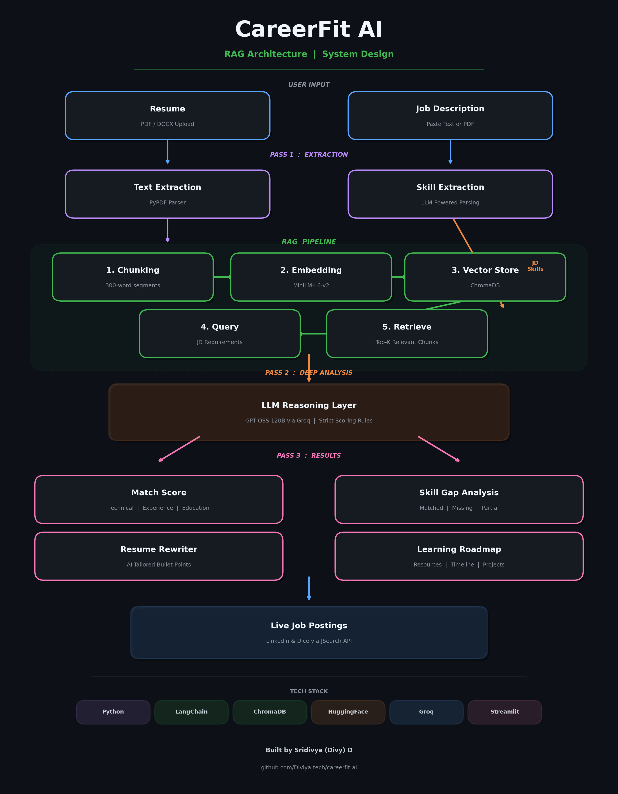
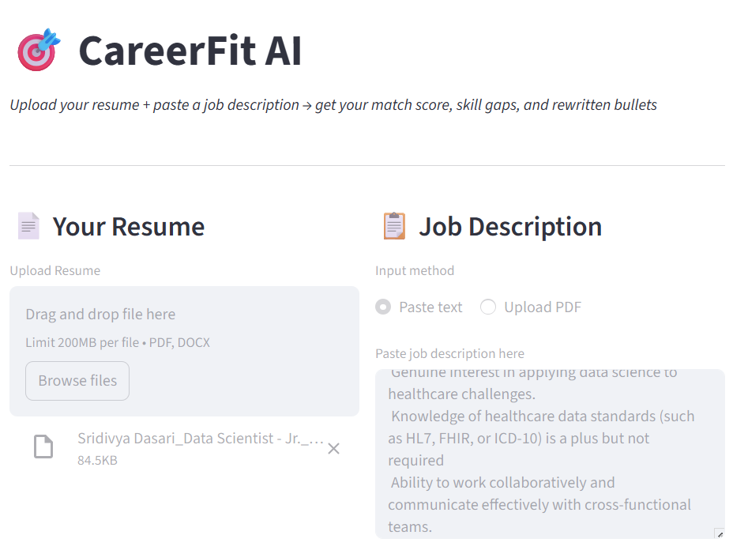
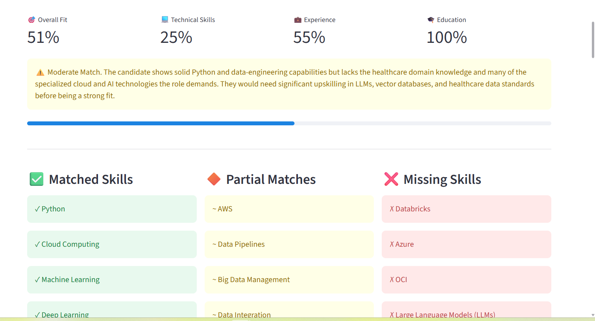
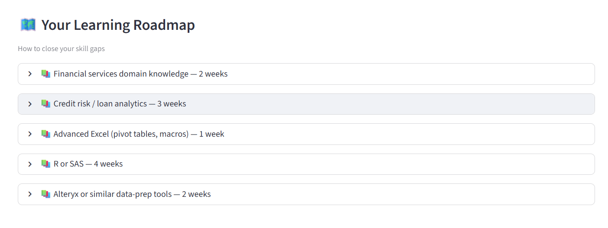

# 🎯 CareerFit AI — AI-Powered Resume Analyzer

**Stop guessing if you fit the role. Know it.**

CareerFit AI is an AI-powered resume analysis tool built with RAG (Retrieval Augmented Generation) that gives you an honest, structured match score against any job description — not just a vague "you're a good fit."

🔗 **Live App:** [Try it on Streamlit](https://diviya-tech-careerfit-ai.streamlit.app)

---

## 📌 The Problem

Every job seeker does this:
- Copy resume → paste into ChatGPT → "Am I a good fit?" → get a vague answer → repeat

The problem? You're blindly relying on a generic AI tool that:
- Gives inflated scores to be "helpful"
- Doesn't break down WHERE you fall short
- Forgets everything when you start a new chat
- Can't detect that "PyTorch" and "TensorFlow" are related skills

**CareerFit AI solves this** with honest scoring, skill similarity detection, and a RAG pipeline that understands your resume at a semantic level.

---

## 🧠 Architecture

CareerFit AI uses a Retrieval Augmented Generation (RAG) pipeline to analyze resume-job alignment.

### Pipeline

1. **Resume Parsing** — Extract text from PDF/DOCX uploads
2. **Job Description Parsing** — Extract requirements from JD
3. **Skill Extraction** — LLM-powered structured skill parsing
4. **Skill Similarity Detection** — Embedding-based cosine similarity to find partial matches
5. **Chunking & Embedding** — Split resume into 300-word chunks, convert to vectors
6. **Vector Similarity Search** — Retrieve most relevant resume sections via ChromaDB
7. **LLM Analysis** — Deep comparison using RAG context + strict scoring rules
8. **Match Score Generation** — Weighted scoring: 40% technical + 30% experience + 20% education + 10% soft skills

### Architecture Diagram



---

## 🔬 Skill Similarity Detection

Most resume analyzers use keyword matching — if the JD says "PyTorch" and your resume says "TensorFlow", it counts as a miss.

CareerFit AI uses **embedding cosine similarity** to detect related skills:

```
Job requires: "PyTorch"
Resume has:   "TensorFlow"
Similarity:   0.82 → Detected as PARTIAL MATCH

Job requires: "Kubernetes"  
Resume has:   "Docker"
Similarity:   0.78 → Detected as PARTIAL MATCH

Job requires: "Python"
Resume has:   "Python"
Similarity:   0.99 → Detected as EXACT MATCH
```

This gives you a much more accurate picture of where you stand instead of binary yes/no skill matching.

---

## 🛠️ Tech Stack

| Component | Technology | Purpose |
|-----------|-----------|---------|
| **LLM** | OpenAI GPT-OSS 120B (via Groq) | Powers all analysis and generation |
| **RAG Framework** | LangChain | Orchestrates the retrieval-augmented pipeline |
| **Vector Database** | ChromaDB | Stores and retrieves resume embeddings |
| **Embeddings** | HuggingFace `all-MiniLM-L6-v2` | Converts text to semantic vectors |
| **Skill Matching** | NumPy + Cosine Similarity | Detects related skills beyond exact keywords |
| **PDF Processing** | PyPDF + python-docx | Extracts text from PDF and DOCX files |
| **Job Data** | JSearch API (RapidAPI) | Fetches live postings from LinkedIn & Dice |
| **Frontend** | Streamlit | Interactive web application |
| **Inference API** | Groq Cloud | Ultra-fast, free LLM inference |

---

## 📊 What You Get

| Feature | Description |
|---------|-------------|
| 🎯 **Match Score** | Overall fit broken down by Technical, Experience, and Education |
| ✅ **Matched Skills** | Skills confirmed in both resume and JD |
| 🔶 **Partial Matches** | Related skills detected via embedding similarity |
| ❌ **Missing Skills** | Skills required by JD but not found in resume |
| 💪 **Strengths** | What makes you strong, with evidence |
| 🔧 **Weaknesses** | Specific gaps with explanations |
| ✏️ **Rewritten Bullets** | Resume bullets rewritten to match JD keywords |
| 🎤 **Interview Questions** | Predicted questions based on your gaps |
| 🗺️ **Learning Roadmap** | Personalized plan with resources and timelines |
| 🌐 **Live Job Postings** | Real-time listings from LinkedIn and Dice |

### Demo

**Match Analysis:**



**Skills Breakdown:**



**Learning Roadmap:**



---

## 📁 Project Structure

```
careerfit-ai/
├── app.py                          # Streamlit UI
├── requirements.txt                # Python dependencies
├── README.md
├── .gitignore
│
├── src/                            # Core AI logic
│   ├── __init__.py
│   ├── resume_parser.py            # PDF/DOCX text extraction
│   ├── job_parser.py               # JD parsing + live job fetching
│   ├── skill_extractor.py          # LLM skill extraction + similarity detection
│   ├── rag_pipeline.py             # Chunking, embedding, vector store, retrieval
│   └── match_score.py              # Scoring logic + learning roadmap
│
├── architecture/
│   └── careerfit_rag_pipeline.png  # System architecture diagram
│
└── Screenshots/
    ├── match_analysis.png
    ├── skills_breakdown.png
    └── learning_roadmap.png
```

---

## 🚀 Getting Started

### Prerequisites

| Key | Where to Get It | Cost |
|-----|----------------|------|
| **Groq API Key** | [console.groq.com](https://console.groq.com) | Free |
| **RapidAPI Key** | [rapidapi.com/JSearch](https://rapidapi.com/letscrape-6bRBa3QguO5/api/jsearch) | Free (200 req/month) |

### Installation

```bash
git clone https://github.com/Diviya-tech/careerfit-ai.git
cd careerfit-ai
pip install -r requirements.txt
streamlit run app.py
```

### Usage

1. Open the app (localhost:8501)
2. Enter your API keys in the sidebar
3. Upload your resume (PDF or DOCX)
4. Paste a job description
5. Click **Analyze My Fit**
6. Review scores, gaps, and recommendations

---

## 🔮 What's Next

- [ ] **CareerPath AI** — Job market intelligence system that scrapes live postings and builds personalized learning roadmaps based on market demand
- [ ] **Interview Prep Mode** — Role-specific interview questions based on gaps
- [ ] **Resume Version Tracking** — Compare fit scores as you improve your resume

---

## 👤 Author

**Sridivya (Divy) D**
- LinkedIn: [sridivyadasari](https://linkedin.com/in/sridivyadasari)
- GitHub: [Diviya-tech](https://github.com/Diviya-tech)

---

*Built with ❤️ as part of my GenAI portfolio — proving that the best way to understand AI is to build with it.*
